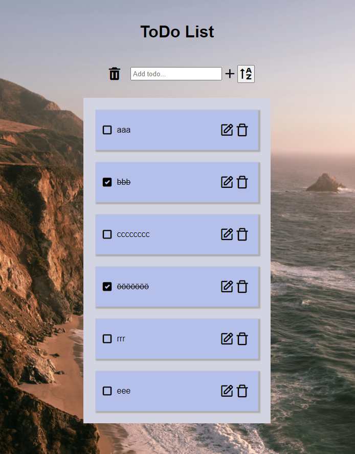

# Todo

```
https://github.com/PaulinJulia/Todo
```

## Description

This project is a Todo-list. 

This task tests the knowledge and ability to develop functionality on websites through Typescript as well as developing web interfaces in HTML and CSS. The project have also used node,js, npm, vite, uuid and icons from Boxicons.

In this project, you can add todos in the list, check the checkbox, and make it done or uncheck. With a click on the A-Z button, you can see all of your todos in alphabetical order. It is also possible to revise the text content on the todo and if you would like to remove one todo you can do that by clicking on the trash bin on the task. It is also possible to clear the whole list of tasks.


## Strengths and weaknesses

This project's strengths
input

## Visuals



## How to install

node.js - https://nodejs.org/en/download  
npm - https://www.npmjs.com/  
vite - https://vitejs.dev/  
Typescript - https://www.typescriptlang.org/  
uuid - https://www.npmjs.com/package/uuid

Icons - https://unpkg.com/boxicons@2.1.4/css/boxicons.min.css

## Usage

If you want to be inspired and have a ToDo list, this project can be useful for you.

## About

The project was carried out by one person for the purpose of learing and consolidate knowledge during a course of advanced frontend development. This project has no intention of continuing.

## Project status

This project is on hold for correcting and feedback. Feel free to pull the code and test the features.

## Support

email address: julia.paulin@chasacademy.se
