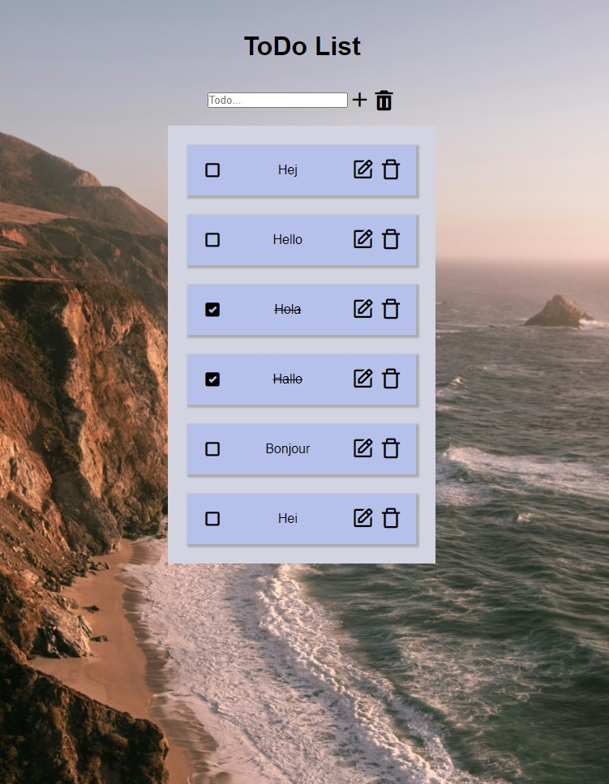

# Todo

```
https://github.com/PaulinJulia/Todo
```

## Description

This project is a Todo-list. 

This task tests the knowledge and ability to develop functionality on websites through Typescript and Javascript as well as developing web interfaces in HTML and CSS based on a design sketch.

## Strengths and weaknesses

This project's strengths
input

## Visuals



## How to install

node.js - https://nodejs.org/en/download  
npm - https://www.npmjs.com/  
vite - https://vitejs.dev/  
Typescript - https://www.typescriptlang.org/  
uuid - https://www.npmjs.com/package/uuid

Icons - https://unpkg.com/boxicons@2.1.4/css/boxicons.min.css


## Usage

If you want to be inspired and have a ToDo list, this project can be useful for you.

## About

The project was carried out by one person for the purpose of learing and consolidate knowledge during a course of advanced frontend development. This project has no intention of continuing.

## Project status

This project is on hold for correcting and feedback. Feel free to pull the code and test the features. Feedback is appreciated.

## Support

email address: julia.paulin@chasacademy.se
